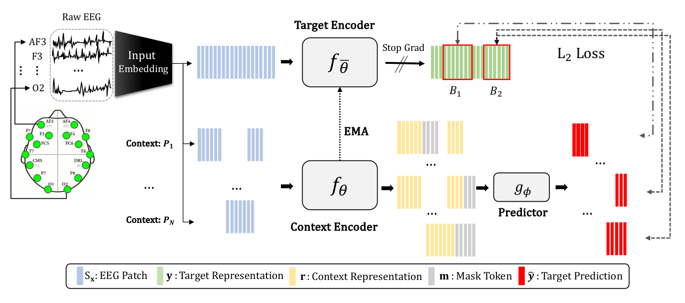

## EEG2Rep: Enhancing Self-supervised EEG Representation Through Informative Masked Inputs
#### Authors: [Navid Mohammadi Foumani](https://scholar.google.com.au/citations?user=Ax62P1MAAAAJ&hl=en), 
[Geoffrey Mackellar](https://www.linkedin.com/in/geoffmackellar/?originalSubdomain=au), 
[Soheila Ghane](https://www.linkedin.com/in/soheila-ghane/?originalSubdomain=au), 
[Saad Irtza](),
[Nam Nguyen](),
[**Mahsa Salehi**](https://research.monash.edu/en/persons/mahsa-salehi)

This work follows from the project with [**Emotiv Research**](https://www.emotiv.com/neuroscience-research-education-solutions/), a bioinformatics research company based in Australia, and [**Emotiv**](https://www.emotiv.com/), 
a global technology company specializing in the development and manufacturing of wearable EEG products.

#### EEG2Rep Paper: [PDF](https://arxiv.org/pdf/2402.17772.pdf)

This is a PyTorch implementation of **EEG2Rep: Enhancing Self-supervised EEG Representation Through Informative Masked Inputs**

    

 

## Datasets 

1. **Emotiv:**
   To download the Emotiv public datasets, please follow the link below to access the preprocessed datasets, which are split subject-wise into train and test sets. After downloading, copy the datasets to your Dataset directory.

   [Download Emotiv Public Datasets](https://drive.google.com/drive/folders/1KQyST6VJffWWD8r60AjscBy6MHLnT184?usp=sharing)

2. **Temple University Datasets:**
   Please use the following link to download and preprocess the TUEV and TUAB datasets.

   [Download Temple University Datasets](#link)